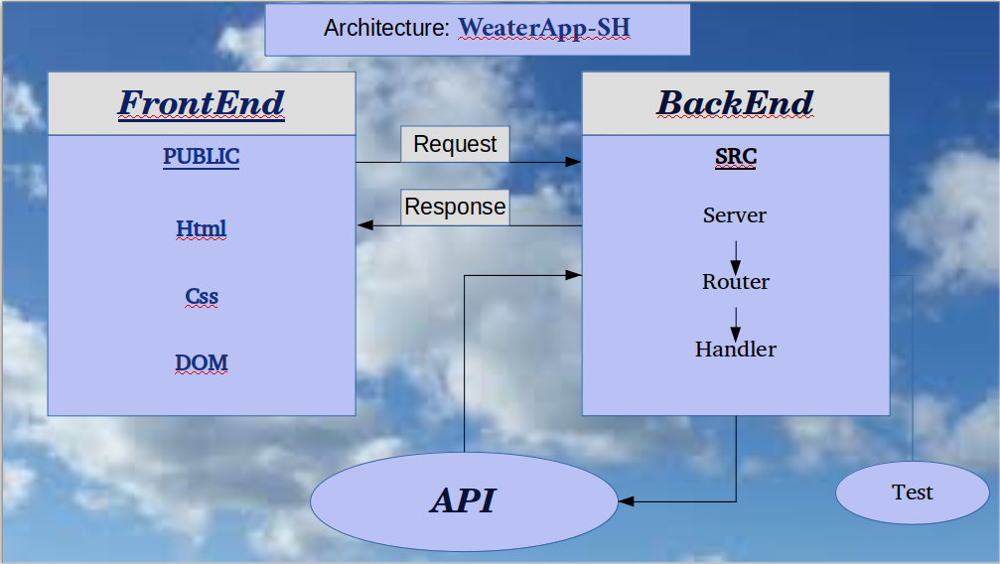

# WeatherApp-SH

** Team members :two_women_holding_hands: **

 - Sabeel Halabi : @sabeel29
 - Hoda Mansour : @hodamansour

**Welcome to our App**

WeatherApp-SH give you the temperature in any city you search.

 First we search acorrect API for the weather, and then we start to code:

 Creating the files:
 - Publice:open_file_folder: (client side)
   * html
   * Css
   * JS

- Src:open_file_folder:(server side)
  * Server
  * Router
  * Handler

- Test:open_file_folder:
    * test.js

If we had more time we prefer to add method to convert the Fahrenheit to Celsius. :partly_sunny:

**Architecture**

